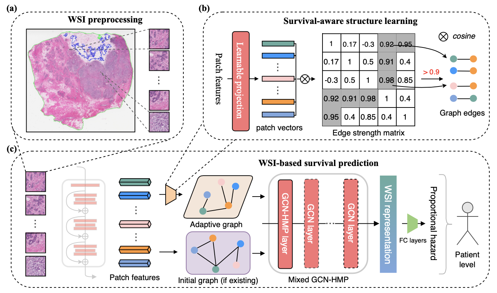

# GraphLSurv 
Source code of the paper titled "**GraphLSurv: A Scalable Survival Prediction Network with Adaptive and Sparse Structure Learning for Histopathological Whole-Slide Images**" and published in *Computer Methods and Programs in Medicine*. The paper is available at DOI: [10.1016/j.cmpb.2023.107433](https://doi.org/10.1016/j.cmpb.2023.107433).

*TLDR*
> This work presented a scalable framework for estimating survival from patient's histopathological Whole-Slide Images (WSIs). In this framework, an adaptive and sparse graph structure is employed to describe each gigapixel WSI and then learn a global representation for prediction. This work absorbed an effecient anchor-based technique to handle very large-scale graphs. We proved that an adaptive and sparse graph structure could be more suitable for WSI-based survival prediction, compared to those densely-connected strutures like that adopted in Transformer. 

GraphLSurv overview:


There are two steps for WSI-based survival prediction: *WSI Preprocessing* and *GraphLSurv Modeling*. We show them below.

## WSI Preprocessing

In this setp, WSIs are converted into multiple image patches and instance features at first. This repo resolves this into four subtasks:
- WSI dataset exploring
- Tissue region segmentating and tiling
- Patch feature extracting
- Overview of the preprocessing result

There are three directories in `S01-preprocessing`:
- **tools**: We fork [CLAM](https://github.com/mahmoodlab/CLAM) and have made it adapted to our task. The current version implements all preprocessing procedures, such as tissue region patching, patch energy calculation, sampling & feature extraction. 
- **scripts**: It provides some essential command-lines for all preprocessing procedures.
- **notebooks**: Notebooks give the details of each preprocessing part, including their results, for better understanding how to preprocess WSIs.

## GraphLSurv Modeling

In this step, the data from the first step will be input to the graph-based network for survival prediction. More details of this step could be found in GraphLSurv paper. 

After you finished *WSI Preprocessing* (please ensure that you have followed the given instructions), you can train GraphLSurv by using the following commands (taking NLST dataset for example): 

```bash
# build the initial KNN graph for each patient from NLST 
cd ./scripts 
## it is optional
./S1-Build-Graph.sh 

# train GraphSurv model on NLST
cd ..
## please set `age_ratio_init_graph` to 0 in a YAML file if you ignored the optional graph building.
python3 main.py --config config/report-nlst.yml --multi_run 
``` 

*About data splitting*: We provided the details of data splitting (all `patient_id` of training/val/test sets) used in experiments. Please see them in `S02-modeling/data_split`. As most methods proposed previously did not make their splitting of training/val/test publicly-available, it is really hard for one who wants to reproduce the reported results. For this reason, we released the data splitting used in our experiments. 

## Citation

Please cite this work if you used it in your research via 
```
@article{LIU2023107433,
    author = {Liu, Pei and Ji, Luping and Ye, Feng and Fu, Bo},
    doi = {https://doi.org/10.1016/j.cmpb.2023.107433},
    issn = {0169-2607},
    journal = {Computer Methods and Programs in Biomedicine},
    pages = {107433},
    title = {{GraphLSurv: A scalable survival prediction network with adaptive and sparse structure learning for histopathological whole-slide images}},
    url = {https://www.sciencedirect.com/science/article/pii/S0169260723001001},
    volume = {231},
    year = {2023}
}

```
or `P. Liu, L. Ji, F. Ye, and B. Fu, “GraphLSurv: A scalable survival prediction network with adaptive and sparse structure learning for histopathological whole-slide images,” Comput. Methods Programs Biomed., vol. 231, p. 107433, 2023, doi: https://doi.org/10.1016/j.cmpb.2023.107433.`

